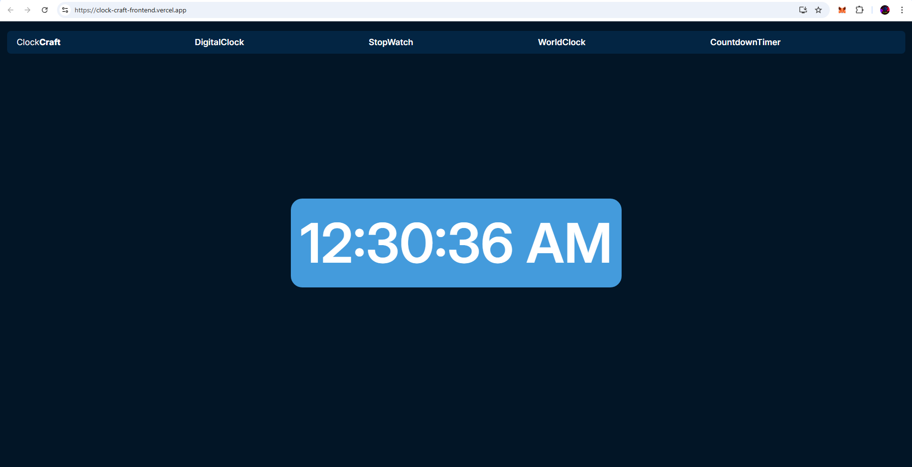
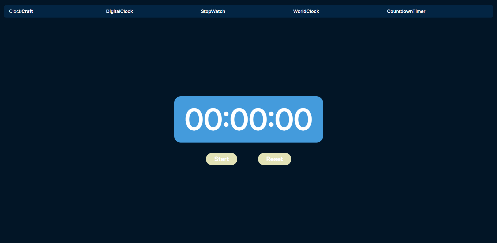
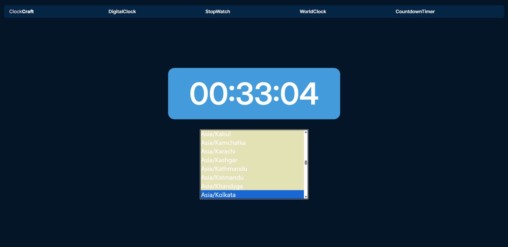

# ⏰ ClockCraft – Web Clock & Timer Application

ClockCraft is a responsive **web application** providing precise **time management tools**, including a stopwatch, timer, and world clock. Track time across multiple zones with an interactive, user-friendly interface.

---

## 🚀 **Live Demo**

🔗 **Deployed App:** [https://clock-craft-frontend.vercel.app/](https://clock-craft-frontend.vercel.app/)

* Frontend: Vercel
* Backend: Vercel

---

## ✨ **Features**

* 🖥️ **Digital Clock** – Shows local time in real-time.
* ⏱️ **Stopwatch** – Start, pause, and reset the stopwatch for precise timing.
* ⏳ **Timer** – Set countdown timers with alerts on completion.
* 🌍 **World Clock** – View current time across 50+ global time zones.
* 📱 **Responsive UI** – Works seamlessly on desktop, tablet, and mobile devices.

---

## 🛠️ **Tech Stack**

### **Frontend:**

* React.js (Vite)
* Tailwind CSS
* React Router
* Axios

### **Backend:**

* Node.js + Express.js
* RESTful APIs (timeapi.io)

---

## 📂 **Folder Structure**

```bash
ClockCraft/
├── client/               # Frontend (React + Vite)
│   └── src/
│       ├── assets/       # Images, icons, fonts
│       ├── components/   # Reusable UI components
│       ├── context/      # React Contexts for global state
│       ├── pages/        # Route-level components
│       ├── services/     # API calls / time services
│       ├── App.js        # Root React component
│       ├── index.js      # React DOM entry point
├── server/               # Backend (Node.js + Express)
│   └── index.js          # Server entry point
```

---

## ⚙️ **Installation & Setup**

### 1️. Clone the Repository

```bash
git clone https://github.com/jidneshmeher/ClockCraft.git
cd ClockCraft
```

### 2️. Install Dependencies

```bash
cd client
npm install

cd ../server
npm install
```

### 3️. Run the Development Server

* **Frontend**

```bash
cd client
npm start
```

* **Backend**

```bash
cd server
npm start
```

---

## 📸 **Screenshots**

### ⌚ DigitalClock Page



### ⏱️ Stopwatch Page



### 🌍 WorldClock Page



### ⏳ CountdownTimer Page


---

## 👨‍💻 Author

**Jidnesh Meher**

* GitHub: [github.com/jidneshmeher](https://github.com/jidneshmeher)
* LinkedIn: [linkedin.com/in/jidneshmeher](https://linkedin.com/in/jidneshmeher)
* Email: [meherjidnesh89@gmail.com](mailto:meherjidnesh89@gmail.com)

---
